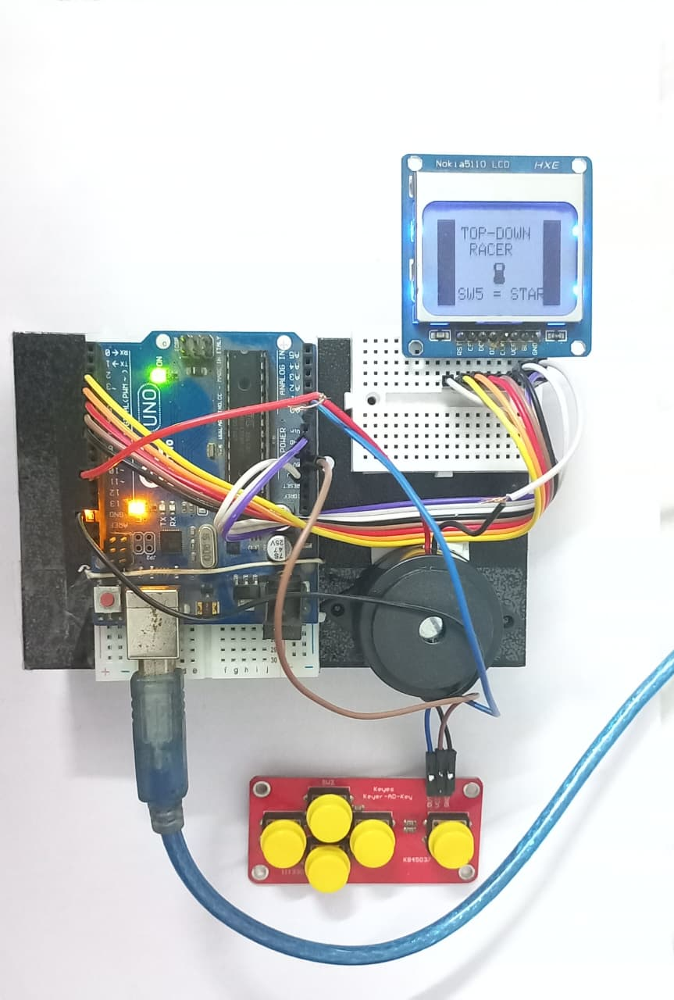

# 🏎️ Top-Down Racer — Arduino & Nokia 5110

A fast-paced, 3-lane arcade racing game built for the Arduino using the classic Nokia 5110 (PCD8544) monochrome LCD. Dodge traffic, manage your speed, and use your Nitro boosts strategically to get the highest score possible!

## 🎬 Gameplay Demo

<video src="gameplay.mp4" controls="controls" style="max-width: 730px;">
</video>

## ✨ Features
* **Classic Arcade Gameplay:** 3-lane dodging mechanics with dynamically spawning traffic.
* **Progressive Difficulty:** The road scroll speed increases every 10 points.
* **Nitro Boost System:** Store up to 3 Nitro charges that slowly refill over time.
* **Sound Effects:** Rising jingle on startup and a descending crash tone using a Piezo buzzer.
* **Visual HUD:** Real-time score tracking, a visual speed indicator, braking alerts, and Nitro pip tracking.

## 🛠️ Hardware Requirements
* 1x Arduino (Uno, Nano, or compatible)
* 1x Nokia 5110 LCD Display (PCD8544)
* 1x Keyes AD Keypad (Analog 5-button module)
* 1x Piezo Buzzer (Active or Passive)
* Jumper wires & Breadboard

## 🔌 Wiring Guide

**Nokia 5110 Display**
| Display Pin | Arduino Pin |
| :--- | :--- |
| CLK (SCLK) | D7 |
| DIN (MOSI) | D6 |
| DC | D5 |
| CE (CS) | D4 |
| RST | D3 |
| VCC | 3.3V |
| GND | GND |

*(Note: The Nokia display operates at 3.3V. If using a 5V Arduino, ensure your specific display module is 5V tolerant or use a logic level converter).*

**Keyes AD Keypad**
| Keypad Pin | Arduino Pin |
| :--- | :--- |
| OUT | A0 |
| VCC | 5V |
| GND | GND |

**Buzzer**
| Buzzer Pin | Arduino Pin |
| :--- | :--- |
| Positive (+) | D10 |
| Negative (-) | GND |

## 🎮 How to Play

The game uses an analog keypad with calibrated ADC thresholds to read button presses on a single pin (`A0`).

* **SW1 (Left):** Move one lane to the left.
* **SW2 (Brake):** Slow down to dodge dense traffic (displays "BRK" on the HUD).
* **SW3 (Nitro):** Activate a massive speed burst (consumes 1 Nitro pip).
* **SW4 (Right):** Move one lane to the right.
* **SW5 (Start/Select):** Start the game or restart after a Game Over.

## 💻 Installation & Setup
1. Clone this repository or download the `.ino` file.
2. Open the code in the Arduino IDE.
3. Install the required libraries via the Library Manager (`Sketch` -> `Include Library` -> `Manage Libraries`):
   * `Adafruit GFX Library`
   * `Adafruit PCD8544 Nokia 5110 LCD library`
4. **Calibrate Buttons:** Verify your Keyes AD Keypad thresholds. If your buttons aren't responding correctly, you may need to adjust the `THR_SW` definitions at the top of the code to match your specific hardware.
5. Upload to your Arduino and race!

---
*Created by Simple-Softwares*
